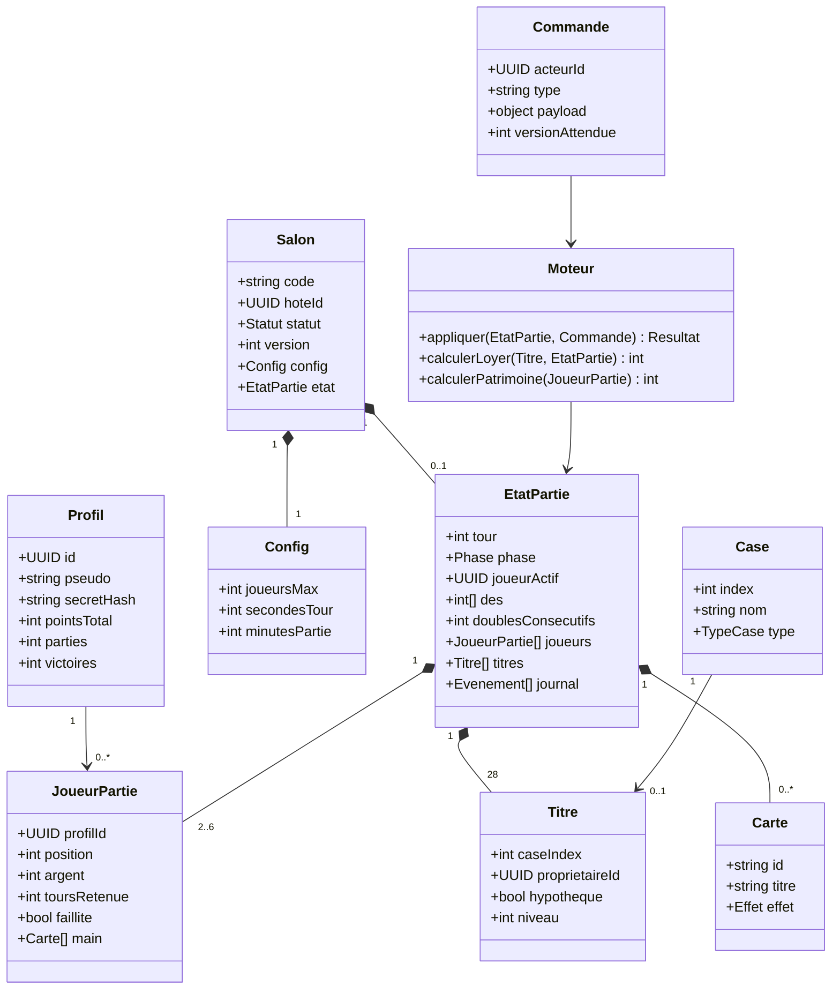
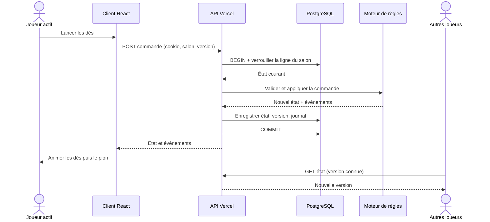
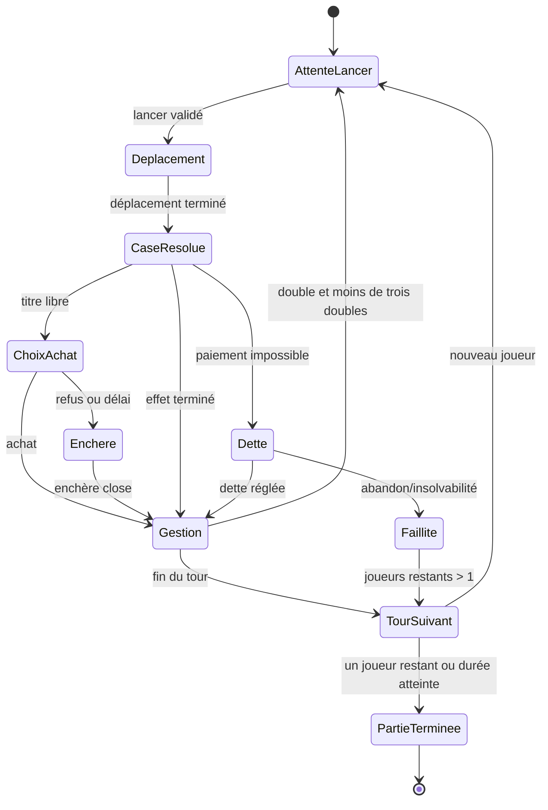
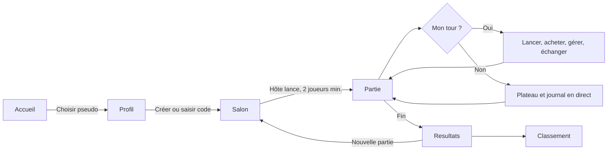

# Cité Capitale — analyse et plan de construction

## 1. Vision du jeu

**Cité Capitale** est un jeu de plateau économique 2D original, conçu pour 2 à 6 amis dans un salon privé. Chaque joueur choisit un pseudo libre tant qu'il n'est pas déjà réservé, rejoint avec un code de salon, achète des quartiers, négocie, construit, encaisse des loyers et cherche à finir avec le meilleur patrimoine. Le jeu reprend les mécanismes généraux d'un jeu immobilier au tour par tour, avec ses propres noms, graphismes, textes et valeurs.

### Expérience visée

- Plateau carré de 40 cases, lisible sur ordinateur et mobile ; pions et propriétés colorés selon leur propriétaire.
- Interface 2D soignée : dés qui tournent, pion avançant case par case, cartes révélées, particules discrètes lors des paiements, transitions des panneaux et indication claire du tour actif.
- Salons privés créés par code à partager ; 2 à 6 joueurs, invitations par lien, hôte qui lance la partie.
- Joueur invité sans mot de passe : pseudo réservé au premier navigateur qui le revendique, session dans un cookie sécurisé. Un code de reprise permet de récupérer le profil sur un autre appareil. Le même pseudo, sans code de reprise, ne donne jamais accès au profil ou aux points d'autrui.
- Partie dont l'état est conservé côté serveur, avec historique des actions et classement global des pseudos après les parties terminées.
- Partie longue classique ou limite optionnelle de 45/60/90 minutes ; à la limite, le patrimoine net départage les joueurs encore actifs.

### Périmètre fonctionnel

1. Inscription invité, reprise de pseudo, classement et statistiques (parties, victoires, points).
2. Création, entrée, sortie de salon ; lobby, choix de couleur de pion, lancement, reconnexion.
3. Tour complet : lancer de deux dés calculé sur le serveur, déplacement, passage par Départ, résolution de case, achat ou enchère, gestion des doubles, fin de tour.
4. Propriétés, groupes de couleur, loyers, transports, services, maisons puis immeuble d'appartements.
5. Cartes Événement et Ville, taxes, prime Départ, case Détente, retenue au Commissariat, trois tentatives de sortie, caution, carte Libération.
6. Transactions entre joueurs (argent, propriété, carte Libération), hypothèques et remboursements, vente de bâtiments, faillite.
7. Chronomètre de tour, déconnexion et retour, fin de partie, calcul des scores, écran de résultats.
8. Accessibilité : clavier, focus visible, contraste, option de réduire les animations et textes qui accompagnent chaque animation.

## 2. Règles et économie

Toutes les sommes utilisent l'unité fictive **¤**. Les montants ci-dessous sont les valeurs de référence, regroupées dans une source unique de données du jeu.

| Paramètre | Valeur | Règle |
|---|---:|---|
| Argent de départ | 1 500 ¤ | Chaque joueur reçoit ce montant au lancement. |
| Initiative | Tirage aléatoire | Le premier joueur est tiré au lancement ; les tours suivent ensuite l'ordre du salon. |
| Passage / arrivée sur Départ | 200 ¤ | Une seule prime par passage ; pas de prime si une carte envoie directement au Commissariat. |
| Achat direct | Prix imprimé | Disponible après un déplacement sur une propriété libre. |
| Refus / délai d'achat | Enchère | Tous les joueurs solvables peuvent enchérir, y compris celui qui a refusé. Mise minimale 1 ¤ ; surenchère minimale 10 ¤. |
| Doubles | Rejouer | Deux dés identiques donnent un nouveau lancer ; trois doubles consécutifs envoient au Commissariat sans résoudre la dernière case. |
| Tour au Commissariat | Jusqu'à 3 tentatives | Un double libère puis déplace sans relance supplémentaire. Sinon, payer 50 ¤ ou utiliser une carte Libération ; après la troisième tentative infructueuse, payer 50 ¤ et avancer selon les dés. |
| Détente | 0 ¤ | Aucun gain venant des taxes. |
| Taxe locale (case 4) | 200 ¤ | Payée à la banque. |
| Taxe patrimoine (case 38) | 100 ¤ | Payée à la banque. |
| Hypothèque | 50 % du prix d'achat | Aucun loyer tant que le titre est hypothéqué. Aucun bâtiment ne peut rester sur le groupe avant une hypothèque. |
| Levée d'hypothèque | Montant reçu + 10 % | Arrondi à l'entier supérieur. |
| Vente de bâtiment | 50 % du coût de construction | Respecte l'équilibre du groupe. |
| Construction | Groupe entier requis | Impossible sur un groupe comportant une hypothèque ; différence de niveaux de 1 au maximum entre les rues du groupe. |
| Niveaux de construction | 0 à 4 | Niveaux 1–3 : maisons ; niveau 4 : immeuble d'appartements. Un seul niveau 4 par rue. |
| Banque de bâtiments | 32 maisons, 12 immeubles | Stock partagé, ventes et faillites rendent les pièces à la banque. |
| Durée du tour | 90 secondes | Après expiration, le serveur applique l'action prévue par la phase. |

### Plateau et prix

Les rues d'un même groupe doivent toutes appartenir au joueur pour déverrouiller construction et doublement du loyer de terrain nu. **L0** est le loyer de base. Les loyers L1–L4 sont calculés au moment du paiement à partir des multiplicateurs ci-dessous.

| Case | Nom | Type/groupe | Prix | L0 | Construction par niveau |
|---:|---|---|---:|---:|---:|
| 0 | Esplanade du Départ | Départ | — | — | — |
| 1 | Rue des Ateliers | Cuivre | 80 | 6 | 50 |
| 2 | La Ville vous parle | Carte Ville | — | — | — |
| 3 | Passage des Artisans | Cuivre | 100 | 8 | 50 |
| 4 | Contribution locale | Taxe | — | 200 | — |
| 5 | Navette du Nord | Transport | 200 | variable | — |
| 6 | Allée des Fresques | Azur | 120 | 10 | 50 |
| 7 | Coup de théâtre | Carte Événement | — | — | — |
| 8 | Place des Musiciens | Azur | 120 | 10 | 50 |
| 9 | Quai des Inventeurs | Azur | 140 | 12 | 50 |
| 10 | Commissariat / Visite | Retenue | — | — | — |
| 11 | Rue des Lanternes | Lavande | 160 | 14 | 100 |
| 12 | Réseau d'énergie | Service | 150 | variable | — |
| 13 | Promenade des Livres | Lavande | 160 | 14 | 100 |
| 14 | Cour des Cinémas | Lavande | 180 | 16 | 100 |
| 15 | Navette de l'Est | Transport | 200 | variable | — |
| 16 | Boulevard des Saveurs | Corail | 200 | 18 | 100 |
| 17 | La Ville vous parle | Carte Ville | — | — | — |
| 18 | Jardin des Épices | Corail | 200 | 18 | 100 |
| 19 | Avenue du Festival | Corail | 220 | 20 | 100 |
| 20 | Parc de Détente | Pause | — | — | — |
| 21 | Place des Étoiles | Rubis | 240 | 22 | 150 |
| 22 | Coup de théâtre | Carte Événement | — | — | — |
| 23 | Rue des Studios | Rubis | 240 | 22 | 150 |
| 24 | Cours des Spectacles | Rubis | 260 | 24 | 150 |
| 25 | Navette du Sud | Transport | 200 | variable | — |
| 26 | Avenue des Serres | Or | 280 | 26 | 150 |
| 27 | Place du Soleil | Or | 280 | 26 | 150 |
| 28 | Réseau d'eau | Service | 150 | variable | — |
| 29 | Promenade des Verrières | Or | 300 | 28 | 150 |
| 30 | Direction Commissariat | Déplacement forcé | — | — | — |
| 31 | Quai des Horizons | Émeraude | 320 | 30 | 200 |
| 32 | Boulevard des Jardins | Émeraude | 320 | 30 | 200 |
| 33 | La Ville vous parle | Carte Ville | — | — | — |
| 34 | Terrasse du Phare | Émeraude | 340 | 32 | 200 |
| 35 | Navette de l'Ouest | Transport | 200 | variable | — |
| 36 | Coup de théâtre | Carte Événement | — | — | — |
| 37 | Allée des Nuages | Saphir | 380 | 36 | 200 |
| 38 | Contribution patrimoine | Taxe | — | 100 | — |
| 39 | Tour des Aurores | Saphir | 420 | 40 | 200 |

**Loyers des rues.** L0 figure dans le tableau. Pour chaque rue : L1 = 4 × L0, L2 = 10 × L0, L3 = 20 × L0, L4 = 30 × L0, arrondis à 10 ¤ au plus proche. Le loyer maximal passe ainsi de 1 800 à 1 200 ¤ sur la Tour des Aurores : il reste décisif sans dépasser à lui seul le capital initial. Un terrain sans bâtiment rapporte 2 × L0 si son propriétaire possède tout le groupe et que cette rue n'est pas hypothéquée. Les transports rapportent 25/50/100/200 ¤ selon que le propriétaire en possède 1/2/3/4. Un service rapporte 4 × le dernier total des dés ; avec les deux services, 10 × ce total.

### Cartes originales à rédiger et intégrer

Deux paquets de 12 cartes, mélangés côté serveur, repiochés après épuisement. Chaque carte a un titre court, un texte clair, un effet machine vérifiable et une variante de narration pour le journal.

| Paquet | Exemples d'effets et montants |
|---|---|
| Événement | Aller au Départ ; aller à la Navette la plus proche ; avancer de 3 cases ; reculer de 2 ; prime créative +75 ¤ ; achat imprévu −60 ¤ ; travaux −40 ¤ par maison et −120 ¤ par immeuble ; reculer au Commissariat ; carte Libération ; recevoir 25 ¤ de chaque adversaire ; payer 25 ¤ à chacun ; aller à la Tour des Aurores. |
| Ville | Bourse municipale +100 ¤ ; amende de stationnement −40 ¤ ; remboursement +50 ¤ ; cotisation −50 ¤ ; concours de quartier +25 ¤ ; aller au Départ ; Commissariat ; Libération ; recevoir 10 ¤ par joueur ; payer 10 ¤ par joueur ; prime de voisinage +75 ¤ ; rénovation −25 ¤ par maison et −80 ¤ par immeuble. |

Les mouvements de carte résolvent ensuite la case d'arrivée. Une carte Libération reste dans la main et revient sous son paquet après usage ou échange. Tous les transferts utilisent la même logique de dette et de faillite que le loyer.

### Transactions, dette et fin

- Une proposition d'échange décrit exactement les titres, la somme et éventuellement les cartes Libération de chaque camp. Les deux joueurs confirment ; toute modification du patrimoine annule la proposition avant acceptation. Aucun bien construit ne se transfère : les bâtiments doivent être vendus d'abord.
- Une dette interrompt la phase courante. Le débiteur peut vendre des bâtiments, hypothéquer, vendre un titre à la banque ou déclarer faillite ; il ne peut pas finir son tour tant que la dette subsiste. En cas de faillite au profit d'un joueur, les titres et l'argent restant vont au créancier et les bâtiments sont rendus à la banque ; au profit de la banque, les titres redeviennent libres. La partie s'achève lorsqu'un seul joueur reste solvable.
- En fin par durée, patrimoine net = espèces + prix imprimés des titres + 50 % du prix des bâtiments − capital des hypothèques. Classement par patrimoine net, puis espèces, puis ordre du tour. Un joueur en faillite est derrière tout joueur actif.
- Points d'une partie terminée : `max(0, floor(patrimoine_net / 10)) + bonus_de_rang`, bonus de 300 / 150 / 75 / 0 / 0 / 0 pour les places 1 à 6. Un joueur en faillite reçoit seulement le bonus de rang s'il est applicable. Le passage de la salle à l'état terminé et l'ajout des points sont effectués dans la même transaction pour éviter un double crédit.

## 3. Écrans, interface et animations

| Écran | Contenu | Mouvement attendu |
|---|---|---|
| Accueil | Pseudo, reprise, créer/rejoindre, classement | Décor de ville en parallaxe léger, titres nets. |
| Salon | Code à copier, joueurs/couleurs, réglages, lancer | Entrée de carte joueur, pulsation discrète du prêt. |
| Partie | Plateau, pions, dés, panneaux joueur, titres, journal, actions contextuelles | Dés 3D simulés en 2D, pion case par case, halo de destination, pièces lors des transferts. |
| Achat/enchère | Carte du titre, prix, argent disponible, mises | Carte qui se retourne, jauge d'enchère. |
| Échange | Deux colonnes patrimoniales, proposition/validation | Titres qui glissent de part et d'autre. |
| Résultats | Podium, détail du patrimoine, points gagnés, rejouer | Confettis mesurés et compteur animé. |

Les animations ne décident jamais de l'état : elles lisent une liste d'événements produits par le serveur. Un bouton permet de les accélérer ; `prefers-reduced-motion` les réduit automatiquement. Le plateau reste utilisable pendant une reconnexion et indique son état réseau.

## 4. Architecture prévue

- **Client** : modules JavaScript natifs + Vite ; SVG/CSS pour le plateau et les animations, sans dépendance à une image protégée.
- **API Vercel** : fonction Node en JavaScript. Elle valide le cookie du joueur, le code du salon, la commande et la version de l'état ; elle applique un moteur de règles pur. Aucun dé ni transfert d'argent calculé par le navigateur.
- **Stockage** : PostgreSQL managé (par exemple Neon), accessible par `DATABASE_URL`, avec transaction et verrou sur la ligne de partie pour sérialiser deux actions simultanées. Les tables contiennent profils, salons/état JSON, journal et scores uniques par partie. Le secret de base reste uniquement côté serveur.
- **Synchronisation** : interrogation légère de l'état par le client (plus fréquente pendant un tour), avec version monotone pour éviter les rendus inutiles. Cela reste compatible avec les fonctions Vercel sans serveur WebSocket permanent.
- **Développement local** : adaptateur mémoire pour essayer le jeu sans base ; la production exige PostgreSQL. Migration SQL et guide de configuration fournis.
- **Confidentialité** : salons accessibles seulement avec leur code ; les requêtes de mutation requièrent la session du joueur. Les pseudos et scores du classement sont publics, mais les codes de reprise ne sont jamais inclus dans les réponses de salon.

La nécessité d'une base externe découle du cycle de vie des [fonctions Vercel](https://vercel.com/docs/functions) : chaque requête peut être une nouvelle invocation. L'emplacement de la fonction sera rapproché de la base pour limiter la latence, conformément aux [conseils Vercel sur les régions](https://vercel.com/docs/functions/configuring-functions/region).

## 5. Diagrammes

### Modèle de données et classes métier

### Flux d'une action multijoueur

### Machine des phases d'un tour

### Parcours du joueur

## 6. Étapes de construction et critères de fin

1. **Socle** — Initialiser Vite et les modules JavaScript, styles globaux, typographie, composants accessibles. Le build fonctionne localement et sur Vercel.
2. **Textes et données** — Écrire les 40 cases et les 24 cartes originales ; centraliser prix, loyers, niveaux et descriptions ; vérifier la somme et la cohérence des données.
3. **Moteur de règles** — Implémenter les transitions déterministes, dés fournis par le serveur, déplacement, cartes, loyers, achats, enchères, constructions, hypothèques, échanges, dette, faillite, fin et score. Couvrir les invariants critiques par des tests ciblés.
4. **Identité et stockage** — Créer profil invité et code de reprise ; ajouter PostgreSQL, migration, transactions, salon, journal et attribution des scores idempotente.
5. **API et salons** — Exposer les opérations de profil, salons, état et commandes ; valider toute entrée et gérer deux commandes simultanées avec la version de l'état.
6. **Interface de partie** — Construire le plateau 2D responsive, HUD des joueurs, fiches de titres, cartes, panneaux d'actions, journal, salon et classement.
7. **Animations et son** — Animer les dés, déplacements, révélations et scores ; ajouter bruitages désactivables, réduire les mouvements selon la préférence système.
8. **Vérification** — Tester à 2, 4 et 6 joueurs, reconnexion, actions simultanées, doubles, cartes, faillite et fin au temps ; vérifier clavier/mobile et build de production.
9. **Déploiement** — Documenter la création de la base, la variable `DATABASE_URL`, la migration et le déploiement Vercel. Valider une partie de bout en bout sur l'URL déployée avant de la partager.

### Définition de « prêt à jouer »

Un salon à deux navigateurs peut finir une partie sans intervention manuelle ; le rechargement conserve identité et état ; les actions simultanées n'altèrent pas l'argent ou les titres ; le classement incrémente les points exactement une fois ; l'interface indique clairement chaque décision en attente ; le site se construit sur Vercel avec les variables documentées.
