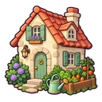
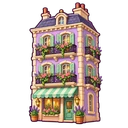
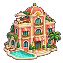
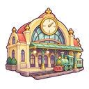
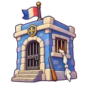
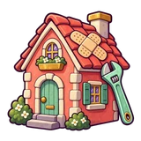
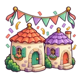

# Catalogue du pack cartoon complémentaire

16 nouvelles illustrations originales générées individuellement avec **imagegen intégré**, 32 exports WebP transparents. Ce pack complète les 38 images déjà présentes dans `public/assets/`.

## Où trouver les fichiers

- Images prêtes à utiliser : `public/assets/pack-cartoon/`.
- Galerie avec recherche et téléchargements : `/assets/pack-cartoon/index.html` sur le serveur du jeu.
- PNG originaux : `assets/source/pack-cartoon/` (hors du dossier public).
- Métadonnées et tailles exactes : `public/assets/pack-cartoon/manifest.json`.
- Prompts complets : [PROMPTS_PACK_CARTOON.md](PROMPTS_PACK_CARTOON.md).
- Configuration des exports : [pack-cartoon.json](pack-cartoon.json).

## Inventaire

Chaque nom ci-dessous existe en `.webp` pour la partie et en `-256.webp` pour une fiche détaillée. Les dimensions incluent les marges transparentes.

| Aperçu | Nom explicite | Contenu | Usage suggéré | Export jeu / affichage |
|---|---|---|---|---|
|  | `batiment-maison-potager` | Petite maison crème au toit corail, potager et arrosoir menthe | Terrain résidentiel ou première construction | 128 px / 48 px |
|  | `batiment-immeuble-balcons` | Immeuble lavande de trois étages avec balcons fleuris et store menthe | Construction améliorée et fiche propriété | 128 px / 48 px |
|  | `batiment-hotel-piscine` | Petit hôtel chic corail et crème, piscine turquoise et palmier miniature | Construction de prestige | 128 px / 48 px |
|  | `batiment-gare-train` | Gare arrondie jaune beurre avec horloge sans chiffres et petit train menthe | Case transport | 128 px / 48 px |
|  | `batiment-banque-coffre` | Banque miniature lavande avec grande porte de coffre ronde et pièce dorée | Banque et réserve d’argent | 128 px / 48 px |
|  | `batiment-prison-evasion` | Petite prison bleue cartoon avec fenêtre à barreaux, une lime et drap noué comique | Case prison | 128 px / 48 px |
|  | `objet-marteau-encheres` | Marteau de commissaire-priseur corail et socle crème avec éclat étoilé jaune | Bouton et fenêtre enchères | 96 px / 32 px |
|  | `objet-cles-propriete` | Deux grosses clés dorées avec porte-clés en forme de petite maison menthe | Achat réussi ou transfert de propriété | 96 px / 32 px |
|  | `objet-portefeuille-billets` | Portefeuille prune dodu avec billets menthe sans inscriptions et deux pièces dorées | Solde et revenus | 96 px / 32 px |
|  | `objet-bouclier-loyer` | Bouclier menthe épais avec une maison crème en emblème et petit éclat doré | Illustration de protection, mécanique optionnelle | 96 px / 32 px |
|  | `evenement-pluie-pieces` | Petit nuage crème souriant qui pleut des pièces dorées, composition joyeuse compacte | Prime, gain ou bonus | 160 px / 64 px |
|  | `evenement-reparations-maison` | Petite maison corail avec pansement sur le toit et clé à molette menthe sur le côté | Carte frais de réparation | 160 px / 64 px |
|  | `evenement-fete-quartier` | Guirlande de fanions corail menthe lavande au dessus de deux maisons rondes et confettis | Carte événement positif | 160 px / 64 px |
|  | `evenement-faillite-tirelire` | Tirelire rose comique avec pansement et une unique petite pièce, expression étonnée mais sympathique | Écran faillite ou manque d’argent | 160 px / 64 px |
|  | `recompense-couronne-vainqueur` | Couronne dorée dodue avec joyaux menthe et corail et rubans lavande | Victoire et classement | 160 px / 64 px |
|  | `recompense-medaille-collection` | Médaille dorée avec trois petites maisons en relief et ruban corail menthe | Collection complète ou succès visuel | 128 px / 48 px |

## Utiliser dans le jeu

Les images sont disponibles via leur URL publique. Exemple :

```html

```

Pour une décoration placée à côté d'un texte équivalent, utiliser `alt=""` et `aria-hidden="true"`. Garder prix, noms de rues et règles en HTML. Utiliser `object-fit: contain` pour conserver la silhouette.

Les bâtiments sont conseillés à 48–64 px sur le plateau et 96–128 px dans les fiches. Les objets conviennent aux boutons à 32–48 px. Les événements et récompenses sont prévus pour 64–128 px. Les fichiers 256 px permettent un affichage net sur écran haute densité.

## Utilisation actuelle dans le jeu

Les alias sont définis dans `src/assets.js` (objet `pack`, préfixe `pack:` pour `asset()`). Chaque image est servie avec sa version 256 px en `srcset` 2x.

| Image | Où elle apparaît |
|---|---|
| `batiment-maison-potager` | Bouton « Construire », niveaux 1–3 du tableau des loyers, réserve de la banque |
| `batiment-immeuble-balcons` | Niveau Immeuble (loyers, cases, réserve de la banque) |
| `batiment-gare-train` | Fiche des navettes (Transport) |
| `batiment-banque-coffre` | Pastille « réserve de la banque » au centre du plateau |
| `batiment-prison-evasion` | Joueur retenu au Commissariat (bandeau d'action, statut), fiche du Commissariat, carte « Commissariat » |
| `objet-marteau-encheres` | Bandeau des enchères |
| `objet-cles-propriete` | Proposition d'achat, « À toi le premier terrain », animation d'achat sur la case, carte « Rejoindre » de l'accueil |
| `objet-portefeuille-billets` | Boutons « Régler la dette » et « Sortir · 50 ¤ », capital de départ dans le salon |
| `objet-bouclier-loyer` | Carte Libération (bouton, statut du joueur, carte piochée) |
| `evenement-pluie-pieces` | Cartes de gain, animation de gain sur la carte du joueur |
| `evenement-reparations-maison` | Cartes de travaux |
| `evenement-fete-quartier` | Cartes entre voisins, carte « Créer la partie » de l'accueil |
| `evenement-faillite-tirelire` | Dette, faillite, cartes de dépense |
| `recompense-couronne-vainqueur` | Joueur en tête pendant la partie, n° 1 des classements, écran de victoire, objectif du salon |
| `recompense-medaille-collection` | Encadré « Un quartier, ça se complète », quartiers complets |

L'hôtel (`batiment-hotel-piscine`) reste disponible pour une future construction de prestige : le jeu n'a pas de niveau au-delà de l'immeuble.

## Animation conseillée

- Achat : apparition des clés avec un léger agrandissement.
- Enchères : petite rotation du marteau au moment de l'adjudication.
- Gain : translation verticale de la pluie de pièces.
- Victoire : apparition de la couronne.
- Réduire ou supprimer les mouvements avec `prefers-reduced-motion`.

Ces suggestions utilisent les images entières ; ce pack ne contient pas de séquences d'animation image par image.

## Réexporter et vérifier

```sh
node scripts/export-pack-cartoon.mjs
```

Le script nécessite Sharp installé localement, ou son chemin en premier argument. Sharp n'est pas nécessaire pour servir les images sur Vercel. Le script contrôle la présence du canal alpha et de pixels transparents pour chacun des 32 exports, puis écrit leurs dimensions, URL et poids dans le manifeste. Il conserve les PNG sources. Les fichiers publics sont compressés en WebP qualité 88 avec alpha qualité 100.

